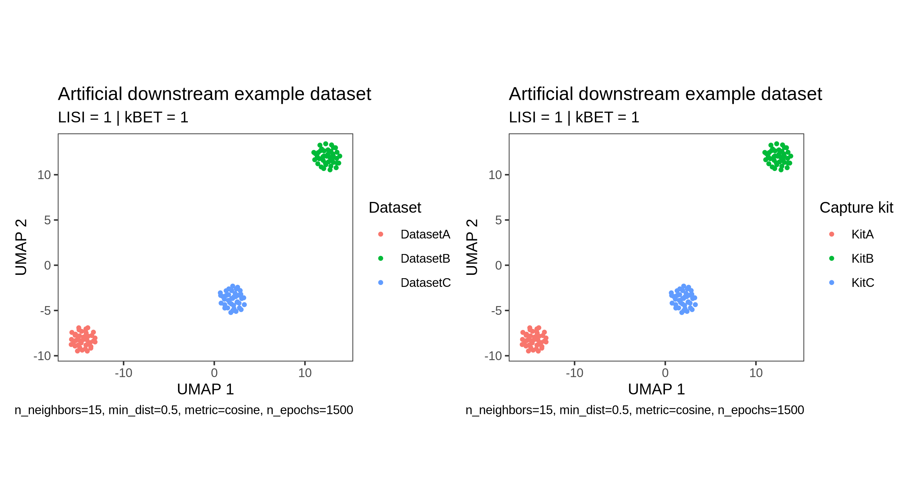
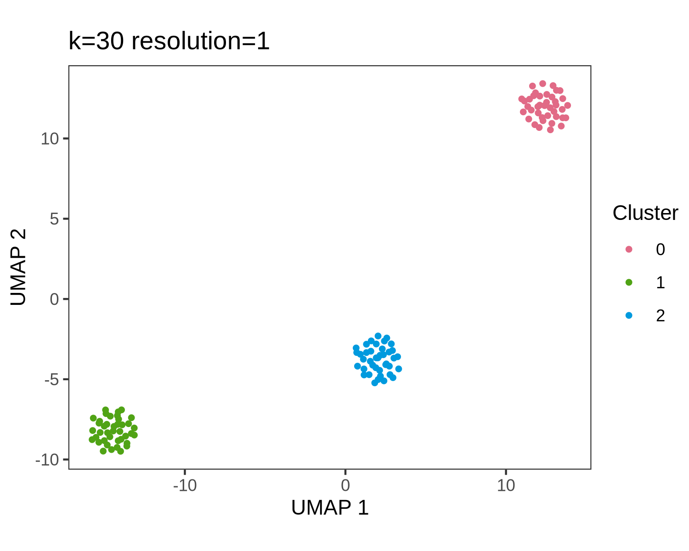
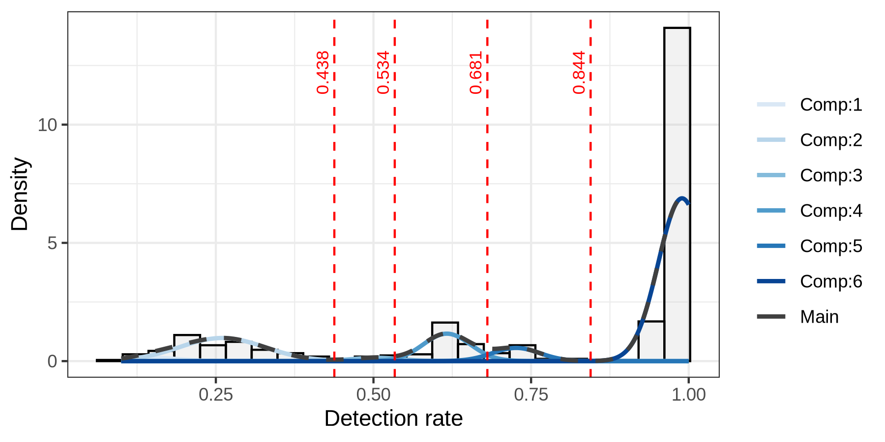
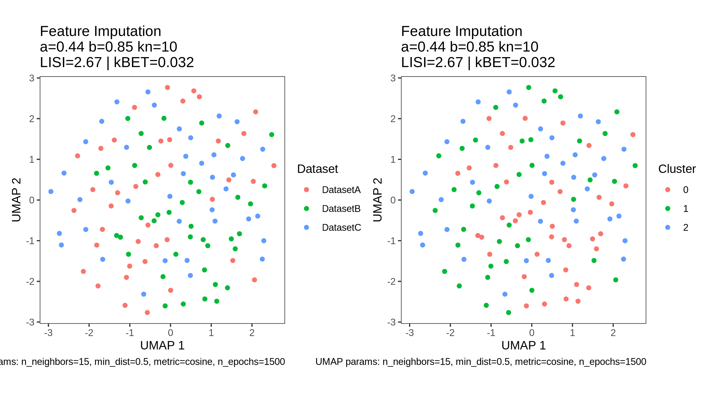

# Lightweight example run

This directory contains a minimal example setup for WESworkflow. 

The example BAM files are derived from the SEQC2 benchmark dataset described by Zhao et al. (2021). Users should cite this dataset when using or referring to the example data:

Zhao, Y., Fang, L.T., Shen, T.W., et al. Whole genome and exome sequencing reference datasets from a multi-center and cross-platform benchmark study. *Scientific Data* 8, 296 (2021). https://doi.org/10.1038/s41597-021-01077-5

The samples are artificially assigned to two example datasets and two example capture kits. These labels are included only to demonstrate the expected metadata structure and should not be interpreted as real technical groups.

The example is intended to verify installation, configuration paths, external resources, and basic workflow execution. It is not intended to reproduce the benchmark analysis or evaluate batch-effect correction performance.

## Directory structure

```text
Data/example/
├── example_samples.tsv
├── download_example_bams.sh
├── make_example_fastqs.sh
├── original_bams/
├── fastq/
├── tmp/
└── output/
```

## Metadata

The file `example_samples.tsv` contains four example samples:

```tsv
sample_id	dataset	capture_kit
sample1	ExampleDatasetA	KitA
sample2	ExampleDatasetA	KitA
sample3	ExampleDatasetB	KitB
sample4	ExampleDatasetB	KitB
```

## Example data

Download public SEQC2 WES BAM files:

```bash
bash Data/example/download_example_bams.sh
```


Create small FASTQ files from selected regions:

```bash
bash Data/example/make_example_fastqs.sh
```

Expected output:

```text
Data/example/fastq/
├── sample1_1.fastq.gz
├── sample1_2.fastq.gz
├── sample2_1.fastq.gz
├── ...
└── sample4_2.fastq.gz
```
For FASTQ reconstruction, a small number of exonic regions, 20 per chromosome, is selected from each chromosome using the repository BED file.

## Notes

This example is a technical execution test, not a biological benchmark.

# Running the example workflow

### Configuration

If not already done, before running the example, create a local configuration file from the main template:

```bash
cp config/example_config.yaml config/local_config.yaml
```

Then edit `config/local_config.yaml` and update paths to local tools and external resources, including the GRCh38 reference FASTA, Beagle files, ANNOVAR, CADD, and the reference panel.

For the example run, set the input and output directories to:

```yaml
directories:
  raw_fastq: "Data/example/fastq"
  trimmed_fastq: "Data/example/output/trimmed_fastq"
  alignment_fastq: "Data/example/fastq"
  bam: "Data/example/output/bam"
  deepvariant_bam: "Data/example/output/bam"
  deepvariant_bam_suffix: "_marked.bam"
  deepvariant_output: "Data/example/output/deepvariant"
  gvcf_search_root: "Data/example/output/deepvariant"
  results_dir: "Data/example/output/results"
  temporary_dir: "Data/example/tmp"
  sample_metadata: "Data/example/sample_path_map_example.tsv"

parameters:
  fastq_r1_suffix: "_1.fastq.gz"
  fastq_r2_suffix: "_2.fastq.gz"
```

## 1. Quality control and trimming

```bash
bash Data_pre_processing/QC/trimm.sh config/local_config.yaml
```

Expected output:

```text
Data/example/output/trimmed_fastq/
├── sample1_1.fastq.gz
├── sample1_2.fastq.gz
├── ...
└── fastqc
      ├── multiqc_report.html
      └── ... (fastqc files)
```
Normally, `multiqc_report.html` contains quality report for the entire cohort and can be used to assess, whether data is suitable for further processing.

## 2. Alignment and duplicate marking

```bash
bash Data_pre_processing/Alignment/alignment.sh config/local_config.yaml
```

Expected output:

```text
Data/example/output/bam/
├── sample1_marked.bam
├── sample1_marked.bam.bai
├── sample1.bam
├── ...
└── sample4.bam
```
As you can see, two BAM files for each sample are produced: raw `sample*.bam` generated by BWA after alignment and `sample*_marked.bam` produced during duplicate marking. Therefore, specifying the suffix in `config/local_config.yaml` is crucial to prevent calling the variants on both of them.

## 3. Variant calling

```bash
bash Variant_calling/Calling/run_deepvariant.sh config/local_config.yaml
```

Expected output:

```text
Data/example/output/deepvariant/
├── sample1.vcf.gz
├── sample1.vcf.gz.tbi
├── sample1.g.vcf.gz
├── sample1.g.vcf.gz.tbi
├── ...
└── sample4.g.vcf.gz
```

## 4. Joint genotyping

```bash
bash Variant_calling/Joint_genotyping/run_GLnexus.sh config/local_config.yaml
```

Expected output:

```text
Data/example/output/results/Genotyping/
├── genotyped_multisample.bcf
├── genotyped_multisample.vcf
├── genotyped_multisample.vcf.gz
└── genotyped_multisample.vcf.gz.csi
```


## 5. Genotype imputation

```bash
bash Variant_post_processing/1_genotype_imputation.sh config/local_config.yaml
```

Expected output:

```text
├── Input_Chromosomes
│   ├── chr1.conformed.log
│   ├── chr1.conformed.vcf.gz
│   ├── chr1.conformed.vcf.gz.tbi
│   ├── chr1.vcf.gz
│   ├── chr1.vcf.gz.tbi
│   ├── ...
│   ├── chr22.conformed.vcf.gz
│   ├── chr22.conformed.vcf.gz.tbi
│   ├── chr22.vcf.gz
│   └── chr22.vcf.gz.tbi
└── Output_Chromosomes
    └── Beagle_1kG_imputed
        ├── chr1.log
        ├── chr1.vcf.gz
        ├── chr1.vcf.gz.tbi
        ├── ...
        ├── chr22.vcf.gz
        ├── chr22.vcf.gz.tbi
        └── chr22.log
```

**Note on genotype imputation example run:** The example dataset is intentionally small and was reconstructed from selected regions of public WES BAM files. Therefore, some chromosomes may contain only a limited number of variants after preprocessing. In addition, genotype conformation against the reference panel may remove all variants from a chromosome if no retained sites match the reference panel.

For this reason, during the example run, chromosomes with no VCF records (i.e. 9, 15, 18, 21) after genotype conformation are skipped before Beagle imputation. This may produce warning messages such as:

```text
WARNING: No VCF records retained for chrN after genotype conformation; skipping Beagle imputation.
```
These warnings are expected for the lightweight example dataset and do not indicate an installation problem. The example run is considered successful if the workflow completes and produces imputed VCF files for the chromosomes where variants were retained.

In a full cohort-scale analysis, substantially more variants are expected, and most autosomes should normally pass through the genotype conformation and imputation steps.


## 6. Variant annotation

```bash
bash Variant_post_processing/2_annotation.sh config/local_config.yaml
```

Expected output:

```text
Data/example/output/results/Annotation/
├── cadd.header.txt
├── CADD_scored
│   ├── chr1.hg38_multianno.filtered_CADD_scored.vcf.gz
│   ├── chr1.hg38_multianno.filtered_CADD_scored.vcf.gz.csi
│   ├── ...
│   ├── chr22.hg38_multianno.filtered_CADD_scored.vcf.gz
│   └── chr22.hg38_multianno.filtered_CADD_scored.vcf.gz.csi
└── multianno
    ├── chr1.avinput
    ├── chr1.hg38_multianno.function_filtered.vcf.gz
    ├── chr1.hg38_multianno.function_filtered.vcf.gz.tbi
    ├── chr1.hg38_multianno.txt
    ├── chr1.hg38_multianno.vcf
    ├── ...
    ├── chr22.avinput
    ├── chr22.hg38_multianno.function_filtered.vcf.gz
    ├── chr22.hg38_multianno.function_filtered.vcf.gz.tbi
    ├── chr22.hg38_multianno.txt
    └── chr22.hg38_multianno.vcf

3 directories, 145 files
```
CADD-scored VCF files are generated only for chromosomes with retained functional variants after ANNOVAR filtering. Because the example dataset is highly reduced, not all chromosomes are expected to produce CADD-scored outputs. Missing autosomes for this run include: chr4, chr10, chr13, chr15 and chr18.

## 7. Gene-level feature aggregation

```bash
bash Variant_to_gene/gene_aggregation.sh config/local_config.yaml
```

Expected output:

```text
Data/example/output/results/Features/
├── chr1
│   ├── sample1.feature.txt
│   ├── sample2.feature.txt
│   ├── sample3.feature.txt
│   └── sample4.feature.txt
├── ...
│   └──  ...
└── chr22
    ├── sample1.feature.txt
    ├── sample2.feature.txt
    ├── sample3.feature.txt
    └── sample4.feature.txt

18 directories, 68 files
```

If a filtered imputed VCF is not available for a chromosome, the example workflow issues a warning and calculates gene-level features using only the CADD-scored original VCF. This behavior is expected for the lightweight example dataset, where some chromosomes 9, 14 and 21 were skipped during genotype imputation due to the lack of retained variants after genotype conformation.

## 8. Feature loading from the lightweight WES example

After chromosome-level feature files are generated, they can be loaded and combined into gene-level matrices for downstream analysis.

```bash
Rscript "Gene-level imputation/1_features_loading.R" config/local_config.yaml
```

Expected output:

```
Data/example/output/results/Gene_level_imputation/
├── Figures
│   └── raw_UMAP.pdf
├── raw_ft_long.tsv
└── raw_umap_result.tsv
```

This step reads per-sample feature files from:

```text
Data/example/output/results/Features/
```

and prepares feature matrices for further analysis. UMAP visualizations of the cohort structure, colored by dataset and capture kit, are written to raw_UMAP.pdf, with batch metrics reported in the plot subtitle. The default parameters for UMAP and batch metric calculation were tested for large cohorts ($N > 500$), but they can be adjusted at the beginning of the script. For the small example run containing only four samples, batch metrics are not calculated due to insufficient sample size. In this case, the script issues a warning and continues execution.


The first rows of the generated `raw_ft_long.tsv` file should have the following structure:

```text
Sample	Gene	CADD_weighted_avg_AF	Dataset	Kit
sample1	OR4F5	1	DatasetA	KitA
sample1	ODF3	0.492227979274611	DatasetA	KitA
sample1	SCGB1C1	0.79450275808056	DatasetA	KitA
```

This table contains one row per sample-gene pair, with the calculated `CADD_weighted_avg_AF` value and the corresponding sample-level metadata.

The end-to-end WES processing steps are computationally intensive and require large intermediate files, especially during alignment, variant calling, joint genotyping, imputation, annotation, and CADD scoring. Therefore, the complete workflow is demonstrated on a reduced four-sample example dataset. However, this dataset is too small to meaningfully demonstrate the cohort-level downstream steps, such as UMAP structure assessment, sample clustering, detection-rate modeling, and gene-level imputation.

For this reason, the downstream gene-level imputation module is demonstrated using a separate artificial feature-level dataset described below.

## 9. Artificial dataset for downstream gene-level imputation

The complete WES example described above is intentionally limited to four samples, because the preceding steps are computationally intensive and generate large intermediate files. This reduced example is sufficient to validate the workflow from sequencing-derived input files to gene-level feature generation. However, it is too small to meaningfully demonstrate the downstream cohort-level steps, including sample clustering, detection-rate modeling, MNAR masking, and gene-level feature imputation.

For this reason, the downstream part of the workflow is demonstrated using a separate artificial feature-level dataset. This dataset contains three artificial datasets, each consisting of 40 samples, with one capture kit assigned to each dataset. The artificial data include systematic kit-specific missing `CADD_weighted_avg_AF` values for selected gene groups to demonstrate detection-rate modeling and downstream imputation behavior.

The artificial dataset can be generated with:

```bash
python Data/example_downstream/generate_artificial_downstream_dataset.py
```

Expected output:

```text
Data/example_downstream/
├── metadata.tsv
└── raw_ft_long.tsv
```

To continue with the downstream gene-level imputation demonstration, replace the small `raw_ft_long.tsv` file generated from the four-sample WES example with the artificial downstream dataset and recompute UMAP:

```bash
RESULTS_DIR="$(python scripts/read_config.py config/local_config.yaml directories.results_dir)"
METADATA_FILE="$(python scripts/read_config.py config/local_config.yaml directories.sample_metadata)"

[[ "$RESULTS_DIR" != /* ]] && RESULTS_DIR="$PWD/$RESULTS_DIR"
[[ "$METADATA_FILE" != /* ]] && METADATA_FILE="$PWD/$METADATA_FILE"

DOWNSTREAM_DIR="$RESULTS_DIR/Gene_level_imputation"

cp "$DOWNSTREAM_DIR/raw_ft_long.tsv" \
   "$DOWNSTREAM_DIR/raw_ft_long.from_wes_example.tsv"

cp "$METADATA_FILE" \
   "${METADATA_FILE}.from_wes_example"

cp Data/example_downstream/raw_ft_long.tsv \
   "$DOWNSTREAM_DIR/raw_ft_long.tsv"

cp Data/example_downstream/metadata.tsv \
   "$METADATA_FILE"

Rscript "Data/example_downstream/umap_from_raw_ft_long.R" config/local_config.yaml
```

The original four-sample WES-derived table is kept as:

```text
Data/example/output/results/Gene_level_imputation/raw_ft_long.from_wes_example.tsv
```

and the original metadata file is backed up with the `.from_wes_example` suffix.

After this replacement, the following downstream scripts operate on the artificial feature-level dataset while preserving the same directory structure and configuration file. The artificial dataset is not intended to represent a biologically meaningful WES cohort. It is provided only to demonstrate the expected input structure and execution of the downstream workflow.



## 10. Sample clustering

```bash
Rscript "Gene-level imputation/2_clustering.R" config/local_config.yaml
```

This step clusters samples based on the generated gene-level feature matrix and produces the UMAP visualization of clustering results. The clustering results are used in the downstream detection-rate modeling and gene-level feature imputation steps. Clustering parameters can be adjusted at the beginning of the script.

Expected output:

```text
Data/example/output/results/Gene_level_imputation/
├── Figures
│   ├── PARC_clustering.pdf
│   └── ...
├── ...
├── sample_kit_cluster_map.tsv
└── umap_parc_k30r1.tsv
```



## 11. Detection-rate modeling

```bash
Rscript "Gene-level imputation/3_GMM.R" config/local_config.yaml
```

This step models gene detection rates across sample clusters. For each gene and cluster, the detection rate is calculated as the proportion of samples with a non-zero CWAF value. The detection-rate distribution is then visualized using Gaussian mixture modeling. This diagnostic step can be used to guide the choice of low- and high-detection-rate thresholds for MNAR masking in the subsequent imputation step.

In the full workflow, a gene-cluster pair is considered potentially under-detected when the gene has a low detection rate in one cluster but a high detection rate in at least one other sufficiently large cluster. These gene-cluster flags are later propagated to the sample level and used to define which missing CWAF entries should be considered MNAR during gene-level imputation.

Expected output:

```text
Data/example/output/results/Gene_level_imputation/
├── GMM_det_rate.RDS
├── ...
└── Figures
    ├── dpGMM_detection_rate_plot.pdf
    └── ...
```


## 12. Gene-level feature imputation

```bash
Rscript "Gene-level imputation/4_feature_imputation.R" config/local_config.yaml
```

This step performs gene-level feature imputation using the artificial downstream feature table and the cluster assignments generated in the previous step. Detection-rate thresholds used for MNAR flagging are defined directly at the beginning of the script as low- and high-detection-rate cutoffs.Based on the diagnostic GMM plot from the previous section, the default manually defined values are `threshold_low_value = 0.44` and `threshold_high_value = 0.85`.

The number of parallel workers and the maximum future object size are configured in `config/local_config.yaml`:

```yaml
parameters:
  feature_imputation_workers: 48
  feature_imputation_future_max_size_gb: 4
```

Expected output:

```text
Data/example/output/results/Gene_level_imputation/
├── Figures
│   ├── a0.44_b0.85_k10_UMAP_cluster_colored.pdf
│   ├── a0.44_b0.85_k10_UMAP.pdf
│   └── ...
├── ft_imp_a0.44_b0.85_k10_long.tsv
├── ft_imp_a0.44_b0.85_k10_umap_result.tsv
├── ft_imp_a0.44_b0.85_k10_wide.tsv
└── ...
```




The artificial downstream dataset is designed only to demonstrate the expected behavior of MNAR masking and gene-level feature imputation. The resulting imputed matrix should therefore be interpreted as a technical workflow output, not as a biologically meaningful WES result.

